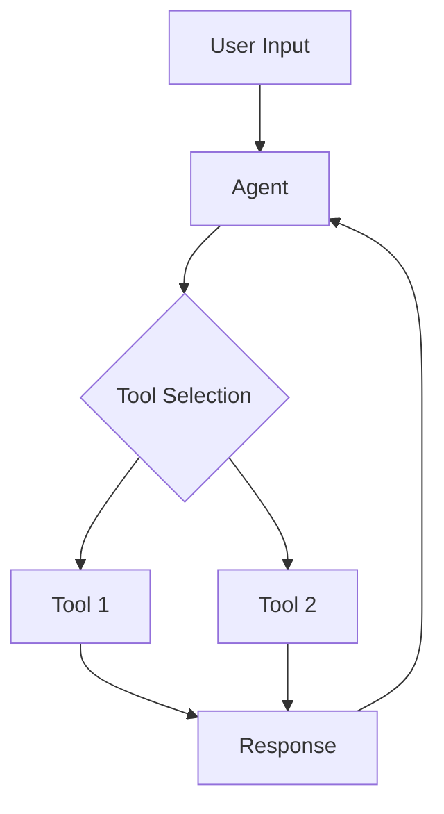

# Visual Elements Guide for Alith Documentation

This guide outlines the standard visual elements to use in Alith documentation to improve readability, highlight important information, and create a consistent experience across all documents.

## Text Formatting

### Headings

Use a consistent heading hierarchy:

```markdown
# Main Document Title (H1)

## Major Section (H2)

### Subsection (H3)

#### Minor Subsection (H4)
```

### Code Blocks

Always specify the language for syntax highlighting:

```markdown
```javascript
const { Agent } = require('alith');
```

```python
from alith import Agent
```

```rust
use alith::Agent;
```
```

### Inline Code

Use backticks for inline code references:

```markdown
Install the package using `npm install alith`.
```

## Callout Boxes

Use blockquotes with bold prefixes for callouts:

### Note Callout

```markdown
> **Note:** This is additional information that might be helpful but isn't critical.
```

### Warning Callout

```markdown
> **Warning:** This is important information about potential issues or pitfalls.
```

### Example Callout

```markdown
> **Example:** Here's how you might use this feature in a real application.
```

### See Also Callout

```markdown
> **See Also:** Check out [related documentation](path/to/doc.md) for more information.
```

## Lists

### Unordered Lists

Use asterisks for unordered lists:

```markdown
* First item
* Second item
* Third item
```

### Ordered Lists

Use numbers for ordered lists:

```markdown
1. First step
2. Second step
3. Third step
```

### Task Lists

Use task lists for checklists or requirements:

```markdown
- [x] Completed task
- [ ] Incomplete task
```

## Tables

Use tables to present structured information:

```markdown
| Feature | Node.js | Python | Rust |
|---------|---------|--------|------|
| Memory  | ✅      | ✅     | ✅   |
| Tools   | ✅      | ✅     | ✅   |
| RAG     | ✅      | ✅     | ✅   |
```

## Diagrams

For complex concepts, consider using ASCII or Mermaid diagrams:

### ASCII Diagrams

```
+----------------+      +----------------+
|                |      |                |
|     Agent      |----->|     Tool       |
|                |      |                |
+----------------+      +----------------+
```

### Mermaid Diagrams (GitHub Compatible)



## Images

When using images:

1. Store them in an `/images` subdirectory
2. Use alt text for accessibility
3. Keep file sizes reasonable

```markdown

```

## Icons and Symbols

Use consistent symbols for common elements:

| Purpose | Symbol |
|---------|--------|
| Successful/Supported | ✅ |
| Not Supported | ❌ |
| Warning | ⚠️ |
| Important | 📌 |
| Example | 💡 |
| Note | 📝 |

## Code Examples Pattern

When showing code examples in multiple languages, use this format:

```markdown
### Node.js

```javascript
// Node.js implementation
```

### Python

```python
# Python implementation
```

### Rust

```rust
// Rust implementation
```
```

## Terminal Commands

Format terminal commands with a prompt symbol and output:

```markdown
```bash
$ npm install alith
# Expected output:
+ alith@0.1.0
added 125 packages in 3.5s
```
```

## API References

Use consistent formatting for API references:

```markdown
### `functionName(arg1, arg2)`

**Parameters:**
- `arg1` (string): Description of arg1
- `arg2` (object): Description of arg2
  - `arg2.property` (boolean): Description of nested property

**Returns:**
- (Promise<Result>): Description of return value

**Example:**
```javascript
const result = await functionName('value', { property: true });
```
```

## Applying These Guidelines

When creating or updating documentation:

1. Review this guide to ensure consistent formatting
2. Apply the appropriate visual elements for your content type
3. Use visual elements to highlight important information
4. Maintain a similar density of visual elements across documents

By following these guidelines, we create a more readable, consistent, and professional documentation experience for all Alith users. 